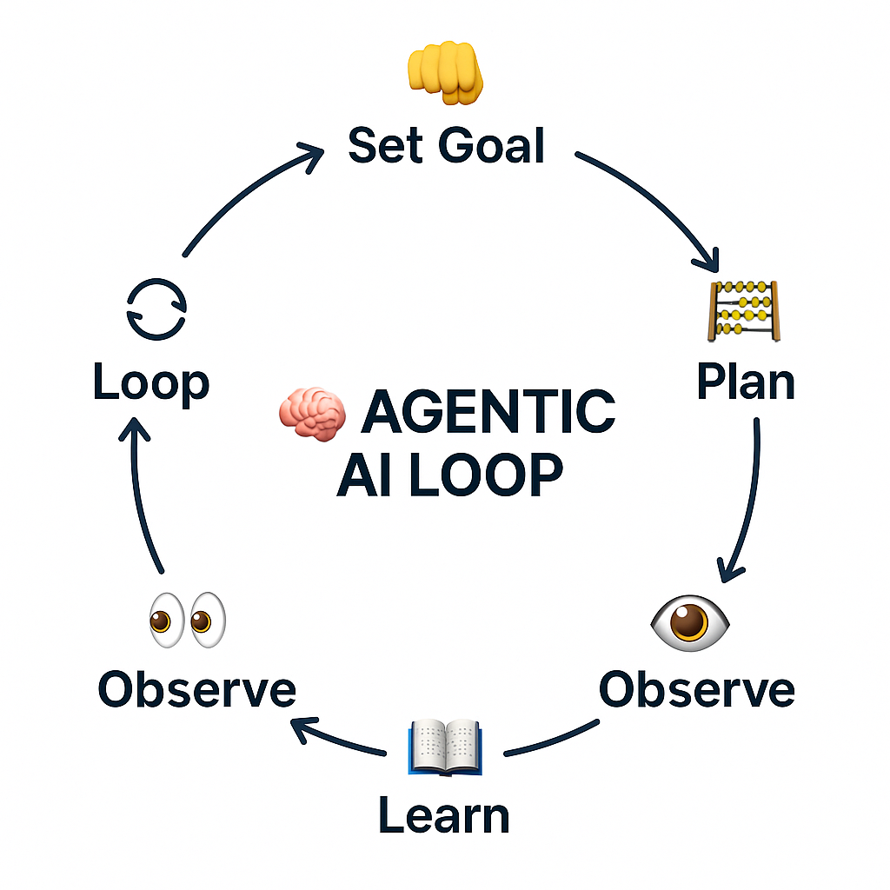

# Revisiting the Roots of AI

Modern AI is easiest to misunderstand when it is only seen through demos. A model answers a question, explains code, writes a plan, or summarizes a document, and the interface makes the system feel simple. Underneath that interaction is a stack of engineering ideas: tokens, parameters, inference, context, retrieval, tool use, orchestration, permissions, and evaluation.

That stack is where AI becomes practical. If I know what the model is doing, I can design better prompts. If I understand context windows, I can decide what information belongs in the request. If I understand retrieval, I can build systems that ground answers in external sources. If I understand agents, I can think more clearly about tools, observations, and safety boundaries.



I revisited these fundamentals through three resources:

- [Generative AI in a Nutshell](https://www.youtube.com/watch?v=2IK3DFHRFfw)
- [LLMs 101: Foundations](https://www.youtube.com/watch?v=zjkBMFhNj_g)
- [Core AI Vocabulary: 7 Terms Every Engineer Should Know](https://www.youtube.com/watch?v=VSFuqMh4hus)

The main takeaway was not that every engineer needs to become a model researcher. It was that engineers building with AI need enough mechanical understanding to make good system decisions.

## The Useful Mental Model

The simplest useful framing is this: an LLM is a probabilistic software component that consumes tokens and produces tokens. It does not automatically know whether an answer is true, current, authorized, or appropriate for a specific workflow. It predicts likely continuations from the prompt, the context, and the patterns encoded in its learned parameters.

That one idea explains both the power and the risk.

The power is that the same interface can support explanation, synthesis, planning, code generation, classification, extraction, and conversation. The risk is that fluent text can look more certain than it is. A model can produce something useful, something wrong, or something subtly incomplete with the same confident surface.

For engineering work, the response is not to treat the model as magic or to dismiss it as unreliable. The response is to design the surrounding system carefully.

The model should be only one component in a larger loop:

```text
User goal
 -> instructions
 -> relevant context
 -> model reasoning or generation
 -> tool calls or retrieved evidence
 -> validation
 -> final response or action
```

The quality of that loop depends on much more than model choice.

## Prompting Is an Interface

Prompting is often described as asking the model a better question. That is partly true, but it undersells what is happening. A prompt is an interface contract for a probabilistic system.

Good prompts define the operating conditions:

- What role the model should play
- What context it should use
- What constraints it must respect
- What output shape is expected
- What it should avoid doing
- How uncertainty should be handled

That makes prompting closer to API design than casual conversation. The prompt is not just text. It is the input surface for a system whose behavior changes based on instruction order, examples, available context, and ambiguity.

The practical lesson for me is that prompt quality should be judged by repeatability, not cleverness. A good prompt makes the desired behavior easier to inspect and easier to test. A weak prompt may work once but fail when the input changes, the task becomes more complex, or the model has to choose between conflicting instructions.

## Context Is a Design Constraint

The context window is one of the most important parts of the system. It acts like working memory: the current prompt, conversation history, retrieved documents, tool outputs, code snippets, and any other visible text the model can use.

More context is not automatically better. Context has cost, latency, relevance, and security implications.

A long context window can help when the task genuinely depends on many details. It can also create failure modes:

- Irrelevant context can distract the model.
- Stale context can make the answer wrong.
- Untrusted context can carry prompt-injection instructions.
- Sensitive context can leak into outputs if boundaries are weak.
- Large prompts can make the system slower and more expensive.

This changes how I think about AI system design. The important question is not "How much can I fit into the prompt?" It is "What does the model need to see to complete this task correctly?"

That is context engineering. It is the discipline of selecting, ordering, filtering, and protecting the information placed in front of the model.

## Retrieval Grounds the System

RAG, or retrieval-augmented generation, is one of the clearest examples of AI becoming a system design problem.

Instead of expecting the model to answer from its internal parameters alone, a RAG system retrieves relevant external information and gives it to the model as context. Usually that means splitting documents into chunks, converting those chunks into embeddings, storing them in a vector database, retrieving semantically similar chunks, and asking the model to answer from that evidence.

The architecture is simple to describe:

```text
Documents
 -> chunks
 -> embeddings
 -> vector database
 -> retrieval
 -> model context
 -> grounded answer
```

The hard part is making each step good enough.

Chunking affects whether retrieval returns complete ideas or broken fragments. Embedding quality affects whether semantic search finds the right material. Ranking affects whether the best evidence appears early enough in context. Prompt design affects whether the model uses the retrieved material or drifts back into unsupported generation.

RAG also changes the validation problem. It is not enough to ask, "Did the answer sound good?" Better questions are:

- Did retrieval find the right source material?
- Did the answer use that material faithfully?
- Did the model cite or reflect the evidence correctly?
- Did it refuse when the evidence was missing?
- Did irrelevant context change the answer?

This is why RAG feels like engineering rather than just prompting. The retrieval pipeline needs measurement, debugging, and maintenance.

## Agents Need Boundaries

Agents extend the basic chat pattern by adding a loop. Instead of only responding, an agent can plan, call tools, observe results, and decide what to do next.

That loop is powerful:

```text
Goal
 -> plan
 -> act
 -> observe
 -> revise
 -> continue or stop
```

It is also where the risk increases. A model that only writes text can still mislead a user, but a model with tools can affect files, APIs, databases, browsers, payments, infrastructure, or other systems. Tool access turns model behavior into operational behavior.

That means agent design has to include permissions from the beginning. The useful questions are concrete:

- What tools can the agent use?
- Which actions require confirmation?
- What data can it read?
- What data can it write?
- Can it call external services?
- How are tool results logged?
- What stops the loop?
- How are failures surfaced to a human?

The agent pattern is not valuable because it makes software feel autonomous. It is valuable when the system can safely break a task into steps, use the right tools, inspect the result, and recover from errors.

The safety work is not separate from the architecture. It is part of the architecture.

## MCP Is About Integration Discipline

The Model Context Protocol matters because tool integration does not scale well when every connection is custom.

Without a shared protocol, each tool becomes its own one-off adapter: a separate way to expose capabilities, pass context, handle permissions, and return results. That can work for a prototype, but it becomes harder to reason about as systems grow.

MCP points toward a more structured integration layer. The model or AI application can connect to external tools and context sources through a common protocol instead of bespoke glue each time.

The engineering value is not only convenience. It is consistency. A clearer integration pattern makes it easier to audit what tools exist, what they expose, and how they are used. For agentic systems, that matters because tool boundaries are system boundaries.

## Vocabulary Separates Different Problems

One reason AI discussions get messy is that several ideas get collapsed into one word. "AI" might mean a chatbot, an LLM, a reasoning model, an agent, a RAG pipeline, an embedding search system, a multimodal model, or a speculative future system.

Clear vocabulary helps separate the engineering problems.

**LLMs** generate or transform language-like sequences of tokens.

**Embeddings** convert content into vectors that can represent semantic similarity.

**Vector databases** store and search those vectors.

**RAG** uses retrieval to ground model output in external context.

**Agents** use loops, tools, observations, and decisions to pursue goals.

**Reasoning models** are optimized for more deliberate multi-step problem solving.

**MCP** standardizes how AI applications connect to tools and context.

**AGI** and **ASI** are future-facing concepts and should not be confused with current engineering patterns like retrieval, tool use, or orchestration.

When the terms are clear, the system questions become clearer too. If an answer is unsupported, the problem may be retrieval or grounding. If an agent takes the wrong action, the problem may be tool permissions or planning. If a response is slow, the problem may be context size, model choice, or tool latency. If output quality changes across similar requests, the problem may be prompt ambiguity or missing evaluation.

## Validation Is the Real Production Layer

The strongest thread across these fundamentals is validation. Modern AI systems need checks around the model because the model alone cannot guarantee truth, safety, or fit for purpose.

Validation can take different forms:

- Unit tests for deterministic surrounding code
- Golden datasets for expected model behavior
- Retrieval evaluation for RAG pipelines
- Citation or evidence checks for grounded answers
- Schema validation for structured output
- Human approval for sensitive actions
- Logs and traces for tool calls
- Rate limits and authentication for public systems
- Refusal behavior for missing or unsafe context

The right validation depends on the risk. A writing assistant does not need the same controls as an agent that can modify infrastructure. A private learning tool does not need the same controls as a public chatbot exposed to untrusted users. But every serious AI system needs some answer to the question: how do we know this worked?

That is the part I want to keep sharpening. AI engineering is not only about getting a model to produce an impressive answer. It is about designing a system where useful behavior can be repeated, inspected, constrained, and improved.

## What I Am Taking Forward

The roots of modern AI are not abstract trivia. They shape day-to-day engineering choices.

Next-token prediction explains why fluency is not the same as correctness. Prompting explains why instructions and constraints matter. Context windows explain why input selection is a design problem. RAG explains how external knowledge can ground generation. Agents explain why tool use needs permissions and observability. MCP explains why integration patterns matter. Validation explains why production AI is more than a model call.

The practical question I keep returning to is:

```text
How do we design the system around the model so the final behavior is useful, observable, and safe?
```

That question is more durable than any single tool or model release. It is also the difference between using AI as a demo and building with AI as an engineer.
